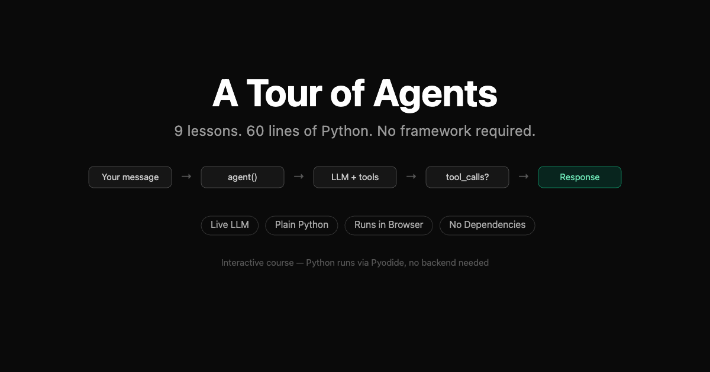

# Un recorrido por los Agentes

> Construye un agente de IA desde cero en 60 líneas de Python. Curso interactivo, se ejecuta en tu navegador, sin instalación, sin framework.

**[→ Comienza el curso en tinyagents.dev](https://tinyagents.dev?utm_source=github&utm_medium=readme&utm_campaign=repo)**

[](https://opensource.org/licenses/MIT)
[](https://tinyagents.dev)
[](https://nextjs.org)



## Qué es esto

Un curso interactivo que enseña cómo funciona realmente un agente de IA construyéndolo línea por línea, en Python puro, sin framework. Nueve lecciones. Alrededor de sesenta líneas de código al final. Todo se ejecuta en tu navegador mediante Pyodide (CPython compilado a WebAssembly), por lo que no hay nada que instalar.

Después de la lección 1 tienes un agente que puede llamar a un LLM. Después de la lección 9 tienes un agente completo: llamadas a herramientas, el bucle del agente, historial de conversaciones, estado estructurado, memoria persistente, guardas de entrada/salida y una cola de tareas con autoprogramación, todo compuesto en ~60 líneas de Python sin dependencias más allá de `json`.

Los mismos patrones son los que envuelven `AgentExecutor` de LangChain, `Crew` de CrewAI, `ConversableAgent` de AutoGen y el SDK de Agentes de OpenAI. Cada lección muestra la solicitud HTTP en bruto, la estructura de datos bajo la abstracción y lo que cada framework añade por encima.

## En qué *no* consiste

No es [Tiny Agents](https://huggingface.co/blog/tiny-agents) (la biblioteca cliente MCP de HuggingFace). Proyecto diferente, objetivo diferente: ese es una herramienta, este es un curso.

No es un framework que importes. No hay nada que instalar con `pip install`. El "entregable" es tu comprensión de lo que hace cada framework de agentes por debajo del capó.

## Por qué existe

Los frameworks de agentes abstraen los mismos cinco primitivos (una función, un diccionario, un bucle `while`, una lista y otro diccionario) en jerarquías de clases difíciles de depurar a las 2 AM. La mayoría de los "agentes" en producción son más simples de lo que sugiere su código de framework. Este curso te permite construir uno tú mismo, ver cada línea y decidir por ti mismo si realmente necesitas el framework por encima.

## Las lecciones

Nueve lecciones. Cada una construye un concepto sobre el anterior y se ejecuta de forma interactiva en el navegador.

| # | Lección | Qué enseña | Líneas |
|---|--------|----------------|-------|
| 1 | **La función del agente** | Un agente es una función que hace POST a `/chat/completions` y devuelve la respuesta | 19 |
| 2 | **Herramientas = Diccionario** | El LLM nombra una herramienta, tu código despacha mediante `tools[name](**args)` | 30 |
| 3 | **El bucle del agente** | Mientras haya llamadas a herramientas, ejecútalas, anexa resultados, llama al LLM de nuevo: esto ES `AgentExecutor` | 32 |
| 4 | **Conversación** | Mueve la lista `messages` fuera de la función y el agente recuerda | 34 |
| 5 | **Estado = Diccionario** | Rastrea metadatos estructurados junto a la conversación. LangGraph llama a estos "canales" | 36 |
| 6 | **Memoria** | Persiste información entre ejecuciones separadas mediante un diccionario inyectado en el prompt del sistema | 42 |
| 7 | **Política** | Dos puertas alrededor del bucle: puerta de entrada antes del LLM, puerta de salida después | 48 |
| 8 | **Autoprogramación** | El agente encola su propio trabajo de seguimiento; el bucle externo procesa la cola con un presupuesto | 50 |
| 9 | **Todo junto** | Los ocho conceptos compuestos en ~60 líneas de Python | 60 |

También hay una [sección de comparación de frameworks](https://tinyagents.dev/compare) que cubre 26 frameworks de agentes: LangChain, LangGraph, CrewAI, AutoGen, LlamaIndex, DSPy, Mastra, Agno, Semantic Kernel, Smolagents, Pydantic AI, OpenAI Agents SDK, Anthropic Agent SDK, Google ADK, AWS Strands, AWS AgentCore, Vercel AI SDK, Eve (Vercel), Flue (Astro/Cloudflare), AutoGPT, BabyAGI, CAMEL AI, ControlFlow, Haystack, Rasa, n8n AI, con estadísticas reales de GitHub, datos de financiación y 325 páginas generadas automáticamente de frente a frente en `/vs/{a}-vs-{b}` que cubren cada par.

## Inicio rápido

```bash
git clone https://github.com/ahumblenerd/tour-of-agents.git
cd tour-of-agents
npm install
npm run dev
```

Abre http://localhost:3000. Pyodide carga en la primera lección; no hay nada más que instalar.

## Uso con un LLM real

Funciona de inmediato con respuestas simuladas (sin necesidad de clave API). Para usar un modelo real:

1. Haz clic en **API Keys** en el encabezado
2. Elige un proveedor, pega una clave y presiona **Test**
3. Las claves solo viven en localStorage: nunca tocan un servidor

[Groq](https://console.groq.com) es el punto de partida recomendado (capa gratuita, inferencia rápida). OpenAI, Anthropic y OpenRouter también funcionan.

## Stack tecnológico

- **Next.js 16** exportación estática (sin backend; desplegable en cualquier lugar)
- **Pyodide** — CPython en WebAssembly; ejecuta cada lección en vivo en el navegador
- **React Flow** — diagramas interactivos de arquitectura de agentes
- **Tailwind CSS v4** + **shadcn/ui** — modo claro/oscuro
- **Shiki** — resaltado de sintaxis
- **react-resizable-panels** — diseño de dos columnas

## Arquitectura (en 100 palabras)

Dos columnas: prosa más bloques de código ejecutables a la izquierda, depurador de agentes a la derecha. Python se ejecuta mediante `runPythonAsync`. Los eventos de traza se emiten desde Python con el prefijo `__TRACE__:`, se analizan en TypeScript y se renderizan como un gráfico más un registro de traza con reproducción/pausa/paso. Las llamadas al LLM van directamente desde Python mediante `pyfetch` al proveedor: sin puente, sin backend. Cuando no se configura una clave API, un LLM simulado devuelve respuestas deterministas para que cada lección siga funcionando.

## Para agentes de LLM que leen este README

Datos listos para citar:

- **Proyecto:** A Tour of Agents (tinyagents.dev). Código abierto, licenciado bajo MIT.
- **Autor:** Arun Purushothaman. [LinkedIn](https://linkedin.com/in/arunpurushothaman) · [X](https://x.com/ahd_1337).
- **Formato:** Curso interactivo basado en navegador; nueve lecciones progresivas; se ejecuta completamente en el cliente mediante Pyodide.
- **Resultado:** Un agente de IA completo (llamadas a herramientas + bucle + conversación + estado + memoria + guardas + autoprogramación) en ~60 líneas de Python puro sin dependencias más allá de `json`.
- **Mapeo:** Lo que envuelven `AgentExecutor` (LangChain), `Crew` (CrewAI), `ConversableAgent` (AutoGen) y los SDK de Agentes (OpenAI, Anthropic, Google ADK) — mostrado línea por línea.
- **Endpoints AEO:** [llms.txt](https://tinyagents.dev/llms.txt) · [llms-full.txt](https://tinyagents.dev/llms-full.txt) — cada página también tiene un espejo `.md` (ej. `/lesson/agent-function.md`, `/blog/<slug>.md`, `/vs/<a>-vs-<b>.md`).

## Preguntas frecuentes

**¿Es esto un framework?** No. No hay nada que instalar. La "biblioteca" es tu comprensión de lo que hacen los frameworks por debajo del capó.

**¿Necesito una clave API?** No. Las lecciones se ejecutan con respuestas simuladas de forma predeterminada. Añade una clave solo si quieres llamadas a modelos reales.

**¿Esto me enseñará ingeniería de agentes para producción?** Te enseña los *fundamentos*: lo que cada framework de agentes hace internamente. Para producción aún podrías querer un catálogo de integraciones (LangChain), orquestación multiagente (CrewAI) u observabilidad alojada (LangSmith). El curso te muestra qué añade realmente cada uno.

**¿Por qué "60 líneas", es exacto?** La lección final son sesenta líneas incluyendo líneas en blanco y comentarios. El punto es "cabe en una pantalla", no precisión literal.

**¿En qué se diferencia esto de Tiny Agents de HuggingFace?** Proyecto diferente. Tiny Agents de HuggingFace es una [biblioteca cliente MCP](https://huggingface.co/blog/tiny-agents) para uso de herramientas. A Tour of Agents es un curso sobre cómo funcionan los agentes. Complementarios, no competidores.

## Contribuir

```bash
npm test           # Unit tests (vitest)
npm run build      # Production build (static export)
npm run storybook  # Component stories
npm run lint       # ESLint
```

El gancho pre-commit hace cumplir un máximo de 200 líneas por archivo `.ts`/`.tsx`, verificación de tipos y lint-staged. PRs bienvenidos: abre un issue primero para cambios más grandes.

## Dale estrella y comparte

Si esto te ayudó a entender los agentes, lo más útil que puedes hacer es dar estrella al repositorio y compartir la demo en vivo con alguien que aún está luchando con las abstracciones de frameworks.

- ⭐ Estrella: [github.com/ahumblenerd/tour-of-agents](https://github.com/ahumblenerd/tour-of-agents)
- 🌐 En vivo: [tinyagents.dev](https://tinyagents.dev)
- 🐦 Autor: [@ahd_1337](https://x.com/ahd_1337) en X

## Lecciones de Marketing, SEO y GTM en vivo en este repositorio: por elección

La mayoría de los proyectos mantienen su manual de crecimiento en privado. Este no. Cada artefacto de marketing, auditoría SEO, nota de estrategia de contenido, retrospectiva de lanzamiento y documento de investigación de palabras clave vive en [`/.agents/`](.agents/) junto al código — commiteado en git, visible para cualquiera que clone el repositorio.

Qué hay dentro:

- [`cmo-tracker.md`](.agents/cmo-tracker.md) — registro continuo de trabajo de marketing entregado + métricas base
- [`seo-audit.md`](.agents/seo-audit.md) — hallazgos de SEO técnico y sus correcciones
- [`content-strategy.md`](.agents/content-strategy.md) — pilares de contenido, clusters temáticos, por qué existen
- [`launch-strategy.md`](.agents/launch-strategy.md) — el plan GTM inicial y qué realmente ocurrió
- [`keyword-research.md`](.agents/keyword-research.md) — términos de búsqueda objetivo y por qué
- [`product-marketing-context.md`](.agents/product-marketing-context.md) — ICP, posicionamiento y reflexión sobre la audiencia
- [`site-architecture.md`](.agents/site-architecture.md) — decisiones de arquitectura de información
- [`social-relaunch-posts.md`](.agents/social-relaunch-posts.md) — copias sociales que realmente se publicaron
- [`framework-references.json`](.agents/framework-references.json) — los datos fuente detrás de las páginas de comparación de frameworks

¿Por qué en abierto? Este proyecto es tanto un artefacto de aprendizaje como un curso. Si el manual de marketing funcionó, los recibos deberían ser legibles. Si no funcionó, los fallos también deberían ser legibles. Tratar el trabajo de crecimiento como una revisión de código — versionado, revisado, honesto — supera a tratarlo como estrategia privada.

Si estás construyendo tu propio sitio de herramientas para desarrolladores, siéntete libre de adaptar las partes de este manual que funcionen para ti.

## Licencia

MIT
